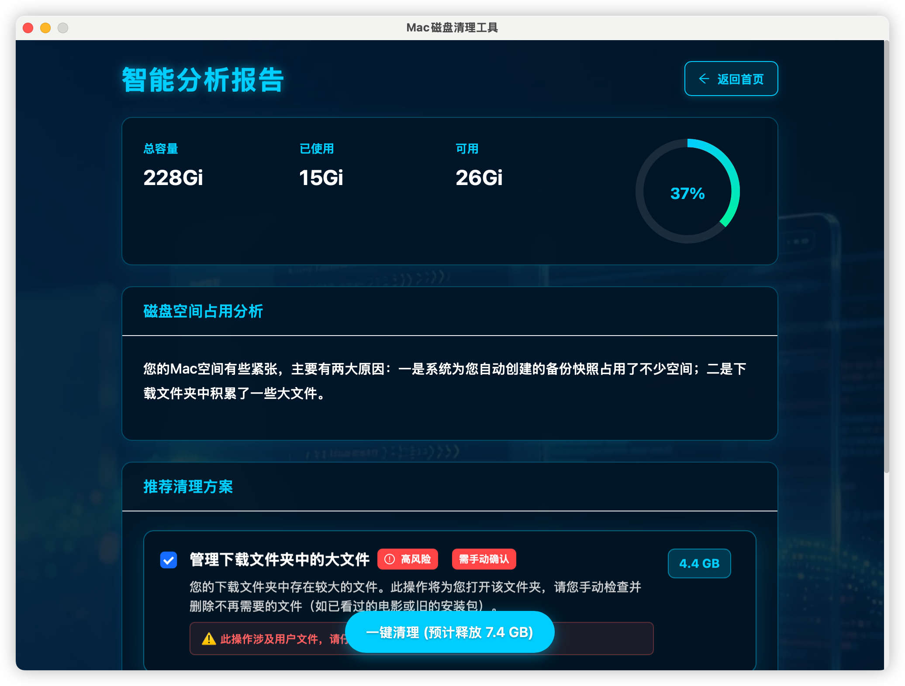
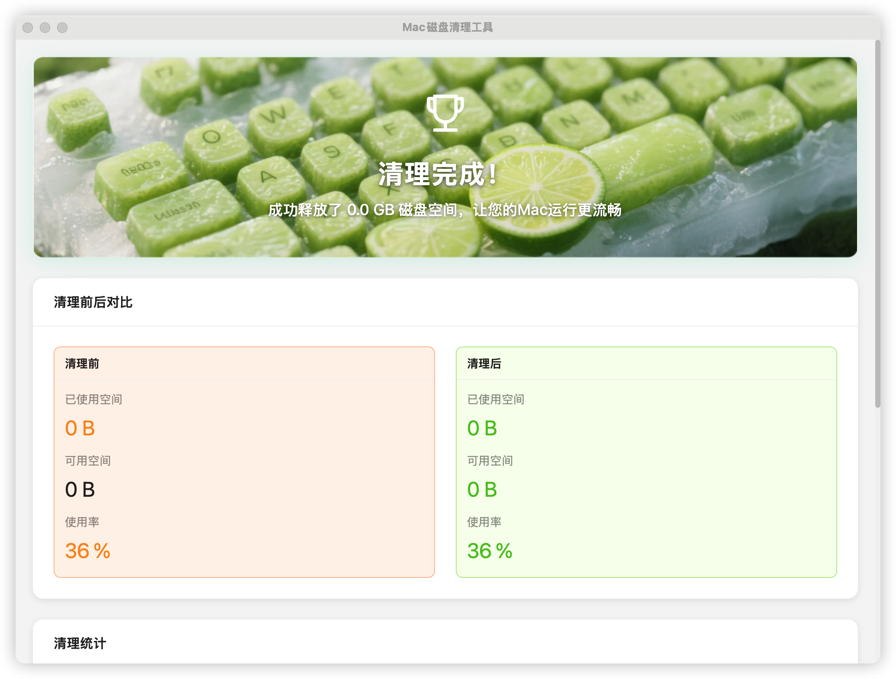

<div align="center">

# 🧹 CleanYourMac

**智能Mac清理工具 - AI驱动的磁盘空间优化解决方案**

[](https://opensource.org/licenses/MIT)
[](https://www.apple.com/macos/)
[](https://tauri.app/)
[](https://reactjs.org/)
[](https://www.typescriptlang.org/)

[English](#english) | [中文](#中文)

</div>

---

## 🌟 功能特色

### 🤖 AI智能分析
- **智能磁盘分析**: 基于AI的存储空间分析和优化建议
- **个性化清理方案**: 根据使用习惯提供定制化清理策略
- **风险评估**: 智能评估清理操作的安全性

### 📸 快照管理
- **智能快照分类**: 自动区分系统更新快照和时间机器快照
- **安全清理**: 使用`tmutil thinlocalsnapshots`安全清理时间机器快照
- **空间预估**: 准确估算快照占用的磁盘空间

### 🎯 精准清理
- **多类型文件清理**: 缓存、日志、临时文件、下载文件等
- **白名单保护**: 保护重要文件和应用不被误删
- **实时进度**: 清理过程可视化，实时显示进度和结果

### 🎨 现代化界面
- **美观UI**: 基于Ant Design的现代化界面设计
- **流畅体验**: React + TypeScript构建的响应式用户界面
- **原生性能**: Tauri框架提供的原生应用性能

## 🚀 快速开始

### 系统要求
- macOS 10.15 或更高版本
- 至少 100MB 可用磁盘空间

### 安装方式

#### 方式一：下载预编译版本
1. 前往 [Releases](https://github.com/GitDzreal93/clean-your-mac/releases) 页面
2. 下载最新版本的 `.dmg` 文件
3. 双击安装包并拖拽到应用程序文件夹

#### 方式二：从源码构建
```bash
# 克隆仓库
git clone https://github.com/GitDzreal93/clean-your-mac.git
cd clean-your-mac

# 安装依赖
pnpm install

# 开发模式运行
pnpm run tauri dev

# 构建生产版本
pnpm run tauri build
```

## 🛠️ 技术栈

- **前端框架**: React 19.1.0 + TypeScript
- **UI组件库**: Ant Design 5.27.0
- **桌面框架**: Tauri 2.x
- **后端语言**: Rust
- **状态管理**: Zustand
- **图表库**: ECharts
- **构建工具**: Vite

## 📱 使用截图

<div align="center">

### 主界面


### AI分析报告


### 清理结果


### 应用设置


</div>

## 🔧 开发指南

### 环境准备
```bash
# 安装 Rust
curl --proto '=https' --tlsv1.2 -sSf https://sh.rustup.rs | sh

# 安装 Node.js (推荐使用 nvm)
nvm install 18
nvm use 18

# 安装 pnpm
npm install -g pnpm

# 安装 Tauri CLI
cargo install tauri-cli
```

### 项目结构
```
clean-your-mac/
├── src/                    # React 前端源码
│   ├── components/         # React 组件
│   ├── services/          # 业务逻辑服务
│   ├── types/             # TypeScript 类型定义
│   └── assets/            # 静态资源
├── src-tauri/             # Tauri 后端源码
│   ├── src/               # Rust 源码
│   ├── icons/             # 应用图标
│   └── Cargo.toml         # Rust 依赖配置
├── public/                # 公共静态文件
└── dist/                  # 构建输出目录
```

### 开发命令
```bash
# 启动开发服务器
pnpm run tauri dev

# 构建前端
pnpm run build

# 构建应用
pnpm run tauri build

# 类型检查
pnpm run type-check
```

## 🤝 贡献指南

我们欢迎所有形式的贡献！请查看 [CONTRIBUTING.md](CONTRIBUTING.md) 了解详细信息。

### 贡献方式
1. Fork 本仓库
2. 创建特性分支 (`git checkout -b feature/AmazingFeature`)
3. 提交更改 (`git commit -m 'Add some AmazingFeature'`)
4. 推送到分支 (`git push origin feature/AmazingFeature`)
5. 创建 Pull Request

## 📄 许可证

本项目采用 MIT 许可证 - 查看 [LICENSE](LICENSE) 文件了解详情。

## 🙏 致谢

- [Tauri](https://tauri.app/) - 跨平台桌面应用框架
- [React](https://reactjs.org/) - 用户界面库
- [Ant Design](https://ant.design/) - 企业级UI设计语言
- [Rust](https://www.rust-lang.org/) - 系统编程语言

## 📞 联系我们

- 项目主页: [https://github.com/GitDzreal93/clean-your-mac](https://github.com/GitDzreal93/clean-your-mac)
- 问题反馈: [Issues](https://github.com/GitDzreal93/clean-your-mac/issues)
- 功能建议: [Discussions](https://github.com/GitDzreal93/clean-your-mac/discussions)

---

<div align="center">

**如果这个项目对你有帮助，请给我们一个 ⭐️**

</div>

---

## English

### 🌟 Features

#### 🤖 AI-Powered Analysis
- **Intelligent Disk Analysis**: AI-driven storage space analysis and optimization recommendations
- **Personalized Cleanup Plans**: Customized cleaning strategies based on usage patterns
- **Risk Assessment**: Smart evaluation of cleanup operation safety

#### 📸 Snapshot Management
- **Smart Snapshot Classification**: Automatically distinguish between system update snapshots and Time Machine snapshots
- **Safe Cleanup**: Use `tmutil thinlocalsnapshots` for secure Time Machine snapshot cleanup
- **Space Estimation**: Accurate estimation of disk space occupied by snapshots

#### 🎯 Precise Cleaning
- **Multi-type File Cleanup**: Cache, logs, temporary files, downloads, and more
- **Whitelist Protection**: Protect important files and applications from accidental deletion
- **Real-time Progress**: Visualized cleanup process with real-time progress and results

#### 🎨 Modern Interface
- **Beautiful UI**: Modern interface design based on Ant Design
- **Smooth Experience**: Responsive user interface built with React + TypeScript
- **Native Performance**: Native application performance provided by Tauri framework

### 🚀 Quick Start

#### System Requirements
- macOS 10.15 or later
- At least 100MB available disk space

#### Installation Methods

##### Method 1: Download Pre-compiled Version
1. Go to [Releases](https://github.com/GitDzreal93/clean-your-mac/releases) page
2. Download the latest `.dmg` file
3. Double-click the installer and drag to Applications folder

##### Method 2: Build from Source
```bash
# Clone repository
git clone https://github.com/GitDzreal93/clean-your-mac.git
cd clean-your-mac

# Install dependencies
pnpm install

# Run in development mode
pnpm run tauri dev

# Build for production
pnpm run tauri build
```

### 🛠️ Tech Stack

- **Frontend Framework**: React 19.1.0 + TypeScript
- **UI Component Library**: Ant Design 5.27.0
- **Desktop Framework**: Tauri 2.x
- **Backend Language**: Rust
- **State Management**: Zustand
- **Chart Library**: ECharts
- **Build Tool**: Vite

### 📱 Screenshots

<div align="center">

#### Home Interface


#### AI Analysis Report


#### Cleanup Results


#### Application Settings


</div>

### 🔧 Development Guide

#### Environment Setup
```bash
# Install Rust
curl --proto '=https' --tlsv1.2 -sSf https://sh.rustup.rs | sh

# Install Node.js (recommended using nvm)
nvm install 18
nvm use 18

# Install pnpm
npm install -g pnpm

# Install Tauri CLI
cargo install tauri-cli
```

#### Project Structure
```
clean-your-mac/
├── src/                    # React frontend source code
│   ├── components/         # React components
│   ├── services/          # Business logic services
│   ├── types/             # TypeScript type definitions
│   └── assets/            # Static resources
├── src-tauri/             # Tauri backend source code
│   ├── src/               # Rust source code
│   ├── icons/             # Application icons
│   └── Cargo.toml         # Rust dependency configuration
├── public/                # Public static files
└── dist/                  # Build output directory
```

#### Development Commands
```bash
# Start development server
pnpm run tauri dev

# Build frontend
pnpm run build

# Build application
pnpm run tauri build

# Type checking
pnpm run type-check
```

### 🤝 Contributing

We welcome all forms of contributions! Please see [CONTRIBUTING.md](CONTRIBUTING.md) for details.

#### How to Contribute
1. Fork this repository
2. Create a feature branch (`git checkout -b feature/AmazingFeature`)
3. Commit your changes (`git commit -m 'Add some AmazingFeature'`)
4. Push to the branch (`git push origin feature/AmazingFeature`)
5. Create a Pull Request

### ☕ Support

If you find this project helpful, consider buying me a coffee! Your support helps keep this project alive and growing.

<div align="center">

[](https://buymeacoffee.com/xjpp228)

<a href="https://buymeacoffee.com/xjpp228" target="_blank">
  
</a>

**Or scan the QR code:**


</div>

### 📄 License

This project is licensed under the MIT License - see the [LICENSE](LICENSE) file for details.

### 🙏 Acknowledgments

- [Tauri](https://tauri.app/) - Cross-platform desktop application framework
- [React](https://reactjs.org/) - User interface library
- [Ant Design](https://ant.design/) - Enterprise-class UI design language
- [Rust](https://www.rust-lang.org/) - Systems programming language

### 📞 Contact Us

- Project Homepage: [https://github.com/GitDzreal93/clean-your-mac](https://github.com/GitDzreal93/clean-your-mac)
- Bug Reports: [Issues](https://github.com/GitDzreal93/clean-your-mac/issues)
- Feature Requests: [Discussions](https://github.com/GitDzreal93/clean-your-mac/discussions)

---

<div align="center">

**If this project helps you, please give us a ⭐️**

**Made with ❤️ for Mac users worldwide**

</div>
